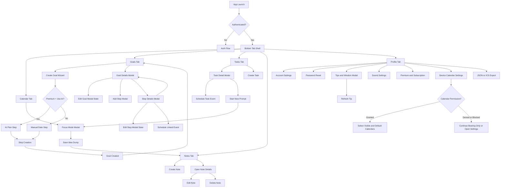

# UX Flow Map

## Purpose

Map user flows for all five tabs, modal transitions, and key branch points so implementation can follow a predictable route structure.

## Global Navigation

- Primary navigation is bottom tabs:
  - Goals
  - Tasks
  - Calendar
  - Notes
  - Profile
- Modals are layered per-tab where needed.

## App Entry Flow

1. Launch app.
2. Resolve auth session.
3. If signed out, show auth flow.
4. If signed in, enter tab shell.

## Calendar Flow

1. User lands on Calendar tab.
2. Bearing displays Firestore events immediately and, when permission exists, live events from user-selected device calendars.
3. User creates or edits full event details and may enable the default-off `Add to system calendar` option.
4. Device-originated events expose edit/delete only when their calendar permits modification.
5. Recurring edits require an explicit occurrence, future, or series scope where supported.
6. User taps Focus Mode; it supports both Bearing and device-originated events.
7. Focus Mode shows current event name, countdown, and Idea Dump input.
8. User saves Idea Dump entry; app creates a note without persisting a device event ID.
9. Permission denial, blocked access, or missing default calendar leaves Bearing-only event CRUD usable.

## Goals Flow

1. User lands on Goals tab and sees goal cards.
2. User taps FAB to start Create Goal wizard.
3. Wizard sequence:
   - SMART education
   - Goal input
   - Premium AI branch or manual branch
   - Completion date (manual path)
   - Step creation
   - Finish
4. User taps existing goal card.
5. Goal Details modal opens (read mode).
6. User options in Goal Details:
   - Edit goal
   - Add step
   - Reorder steps (drag handle)
   - Tap step card to open Step Details
   - Close modal
7. Step Details modal options:
   - Edit step
   - Schedule event tied to goal + step
   - View linked event list
   - Back to Goal Details

## Tasks Flow

1. User lands on Tasks tab and sees active unscheduled tasks by default.
2. User can toggle completed tasks into view.
3. User taps FAB to create a task with title and optional description.
4. User taps an existing task card.
5. Task Details modal opens.
6. User options in Task Details:
   - Edit task
   - Mark task complete manually
   - Schedule task into Calendar using a prefilled event modal
   - Start Now by entering a duration in minutes
   - Delete task
7. Schedule and Start Now both mark the task completed and remove it from the default active list.
8. Start Now switches the user to Calendar and opens Focus Mode on the newly created event.

## Notes Flow

1. User lands on Notes tab and sees note cards.
2. User taps FAB to create note.
3. User opens a note detail modal, then can edit or delete the note.
4. Idea Dump-created notes appear in same list with source metadata.

## Profile Flow

1. User lands on Profile tab.
2. User can:
   - Manage account display name
   - Review account email
   - Choose timezone from searchable dropdown
   - Choose locale from searchable dropdown
   - Secure an anonymous session with email/password when needed
   - Reset password
   - Open Tips & Wisdom modal
   - Refresh to a different tip or wisdom entry
   - Configure and preview timer and reminder sounds
   - Request/review calendar permission
   - Select visible device calendars
   - Choose one writable default calendar
   - Export account data as JSON or Bearing events as ICS
   - Manage premium AI access

## Modal and Transition Graph

## Route and State Planning Notes

- Keep tab routes stable for analytics and deep linking.
- Keep Goal Details and Step Details as explicit modal routes for predictable back behavior.
- Keep Task Details, Schedule Task, and Start Now as modal flows layered from the Tasks tab.
- Ensure Step Details back action always returns to Goal Details (not directly to tab root).
- Preserve pending form state during multi-step wizard transitions.

## Edge Cases to Validate

- Focus Mode with no active event.
- Goal wizard cancellation at each step.
- Reordering steps while some are completed.
- Creating an event from Step Details when calendar permission/default destination is unavailable.
- Revoking calendar permission while Calendar is visible.
- Removing or changing a selected/default calendar outside Bearing.
- Editing a linked event on another device or in the system calendar.
- Confirmed external deletion versus an event merely outside the visible range.
- Partial Firestore/native publication and deletion failures.
- Starting a task immediately while another event is already active.
- Deleting notes created from Idea Dump without breaking source references.

## Test Coverage Targets (Behavior-Oriented)

- Tab switching and route stability.
- Goal wizard branching (AI path vs manual path).
- Modal back-stack correctness (Goal Details <-> Step Details).
- Idea Dump save path to Notes list visibility.
- Profile actions navigation and success/error feedback.
